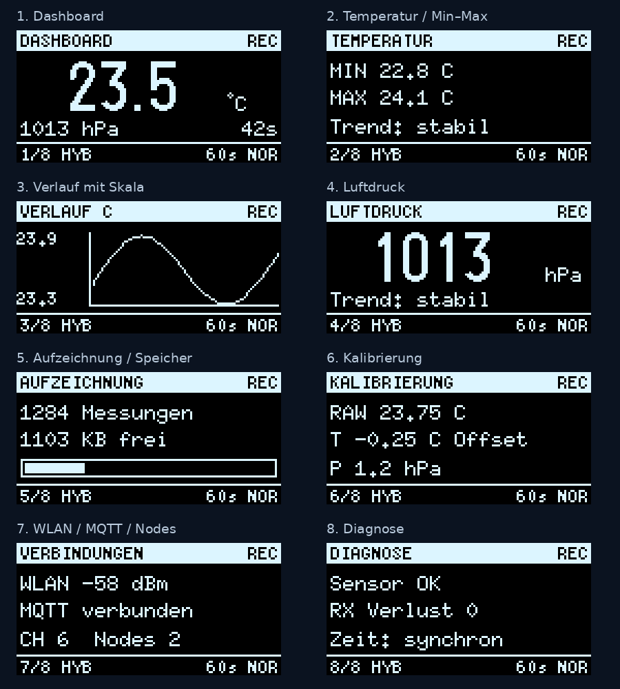

# ESP32-BMP280-Datenlogger

Temperatur- und Luftdrucklogger mit ESP32-C3, SH1106-OLED, Encoder,
CSV-Speicherung, ESP-NOW, Weboberfläche, OTA und Python-PC-GUI.

**Stand: V74.3 – Vorabversion.** Hosttests bestehen; vollständiger Build dieser
Version, Hardwaretest und 24-Stunden-Abnahme sind noch offen.
Siehe [Teststatus](docs/TESTSTATUS.md).

## Funktionen

- Eigenständige Messung und Aufzeichnung in SENSOR/HYBRID.
- Acht OLED-Seiten, Aktualisierung nur veränderter Displaykacheln.
- Temperatur-/Druckverlauf für 1, 6, 12 und 24 Stunden im laufenden Betrieb.
- USB-Ausgabe mit begrenztem Puffer, damit ein nicht lesender PC nicht blockiert.
- Lokale CSV-Dateien, Funkübertragung mit Quittungen und Nachlieferung.
- PC-Archiv in SQLite, Diagramme und CSV-Export.
- WebGUI und OTA über Geräte-IP; MQTT/Home-Assistant-Anbindung.



Die Vorschau zeigt simulierte Messwerte der V74. Die Grafikseite wurde in V74.3
erweitert; das Bild zeigt deren ältere Darstellung, kein Hardwarefoto.

## Hardware

| Bauteil | Anschluss |
|---|---|
| ESP32-C3 | 4 MB Flash, nativer USB |
| SH1106 128 × 64 | I²C 0x3C |
| BMP280 | I²C 0x76 |
| SDA / SCL | GPIO8 / GPIO9 |
| Encoder A / B / Druck | GPIO0 / GPIO1 / GPIO3 |
| BAK / CONTR | GPIO4 / GPIO5 |

BMP280 misst Temperatur und Druck, keine Luftfeuchte.

## Gehäuse / 3D-Druck

Das im aufgebauten Datenlogger verwendete Gehäuse stammt laut Projektinhaber
aus diesem STL-Archiv auf Hackster.io:

**[Gehäuse-STL-Dateien herunterladen (ZIP)](https://hacksterio.s3.amazonaws.com/uploads/attachments/1914724/stl_files_MuvhP6NFu3.zip)**

Der Projektinhaber hat diesen Link am 15.09.2026 als Quelle seines Gehäuses
bestätigt. Das Archiv wird hier als externe Originalquelle verlinkt.

### Für den Nachbau

1. ZIP-Datei über den Link herunterladen und lokal entpacken.
2. Die enthaltenen STL-Dateien im Slicer öffnen.
3. Vor dem Druck die Abmessungen und Ausschnitte mit dem eigenen ESP32-C3-Board,
   OLED, Encoder und den Tastern abgleichen. Andere Modulbauformen können
   Anpassungen erfordern.

Der Archivinhalt wurde für diese Dokumentation noch nicht geprüft. Deshalb sind
hier keine bestimmten Dateinamen, Gehäusemaße, Schraubengrößen oder Druckparameter
als verifiziert angegeben. Die ursprüngliche Projektseite, der Designer und die
Lizenz der Gehäusedateien sind bislang nicht dokumentiert.

## Firmware installieren

1. Repository als ZIP herunterladen und entpacken.
2. `Esp32_LCD_Datalogger/Esp32_LCD_Datalogger.ino` öffnen. Der vollständige Sketch
   enthält die USB-Konsole; eine zusätzliche LoggerConsole.h wird nicht benötigt.
3. ESP32-Boardpaket **3.3.11** und Bibliotheken installieren:
   **U8g2 2.36.19**, **Adafruit BMP280 Library 3.0.0**, **Adafruit Unified Sensor
   1.1.15**, **Adafruit BusIO 1.17.4**, **PubSubClient 2.8**.
4. **ESP32C3 Dev Module**, **USB CDC On Boot: Enabled**, **Flash Size: tatsächliche
   Boardgröße**, bisherige **Default-4MB-Partitionierung** beibehalten.
   **Erase All Flash: Disabled**, **Sketch → Für Debugging optimieren: AUS**.
5. Für eigene Funk-Nodes `PAIR_SECRET` durch denselben privaten Wert ersetzen.
   Der veröffentlichte Wert ist ein bekanntes Beispiel, kein geheimer Schlüssel.
   Beim Wechsel gegenüber einer älteren Firmware alle beteiligten Nodes passend
   aktualisieren und neu koppeln. Private Anpassungen nicht veröffentlichen.
6. Kompilieren und hochladen. Für eigenständigen Dauerbetrieb SENSOR/HYBRID,
   NORMAL oder ECO und Logging AN wählen.

Es liegt keine fertig kompilierte Firmware-BIN bei.

## PC-GUI

Python 3.10 oder neuer mit Tkinter installieren. Unter Windows zuerst
`install_requirements.bat`, anschließend `start_gui.bat` starten.
Alternativ:

```sh
python -m pip install -r requirements.txt
python bmp280_logger_v74_gui.py
```

`logger_protocol.py` muss neben der GUI liegen. Dateinamen und Archivpfad behalten
V74 bei, damit vorhandene Archive weiterverwendet werden. Die kompatible GUI
meldet V7.4.2, die Firmware V7.4.3. `build_exe_v74.bat` kann unter Windows eine
EXE erzeugen; eine fertige EXE ist nicht enthalten.

## Grafik bedienen

| Auf der Grafikseite | Aktion |
|---|---|
| Encoder drücken | Temperatur ↔ Druck |
| BAK drücken | 1h → 6h → 12h → 24h |
| CONTR drücken | Menü |
| Encoder drehen | Anzeigeseite wechseln |

Ein letzter Wert pro Minute wird vorgehalten. **Nach Neustart oder Deep Sleep
beginnt der RAM-Verlauf neu.** CSV-Dateien bleiben erhalten und werden nicht in
diese OLED-Grafik nachgeladen. [Details zum Verlauf](docs/VERLAUF.md).

## Web, Funk und Daten

[Bedienung, Archiv, Zeitbasis, MQTT und Funk](docs/BEDIENUNG.md).
WebGUI/OTA per IP-Adresse öffnen; mDNS/.local ist nicht enthalten.
Werkszugang Web: `admin` / `admin`; vor Nutzung ändern.
Fallback-WLAN: `BMP280-Logger-<ID>`, Beispielpasswort `adminadmin`.
Web und MQTT nutzen hier keine TLS-Absicherung; nur im vertrauenswürdigen lokalen
Netz betreiben. Keine Router-Portfreigabe für WebGUI oder OTA einrichten.

## Tests

Python-Abhängigkeiten und g++ erforderlich. Im Repositoryverzeichnis:

```sh
python tests/test_v74.py
python tests/test_radio_host.py
python tests/test_console_host.py
python tests/test_graph.py
```

## Versionen und Lizenz

[Änderungen](CHANGELOG.md). Eine Open-Source-Lizenz wurde vom Projektinhaber noch
nicht festgelegt. Bibliotheken werden über ihre jeweiligen Paketquellen bezogen;
deren eigene Lizenzbedingungen gelten weiter.
