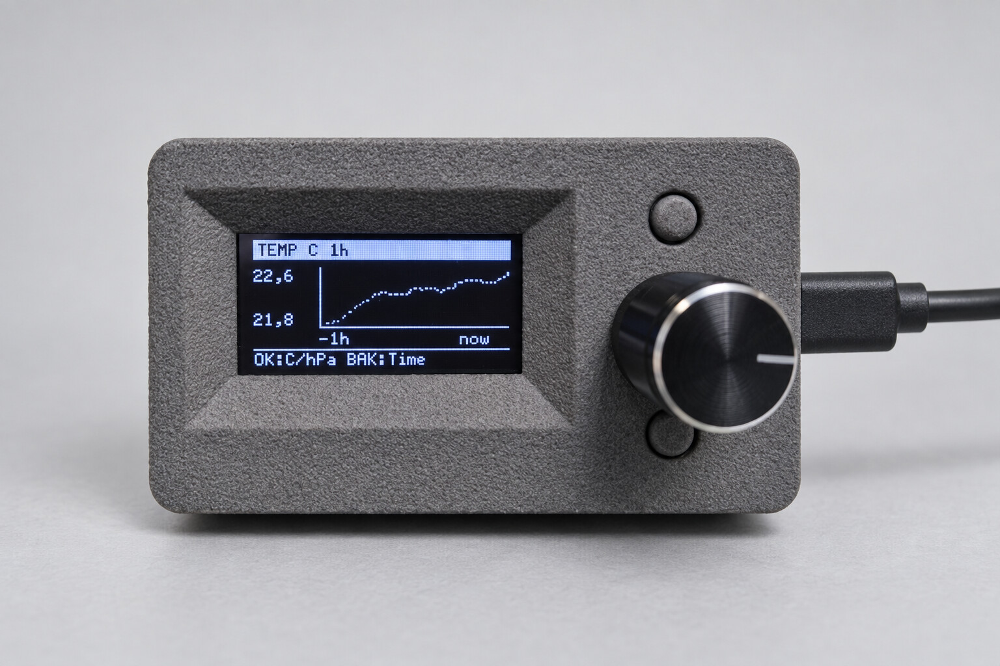
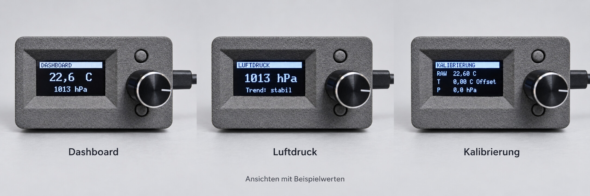
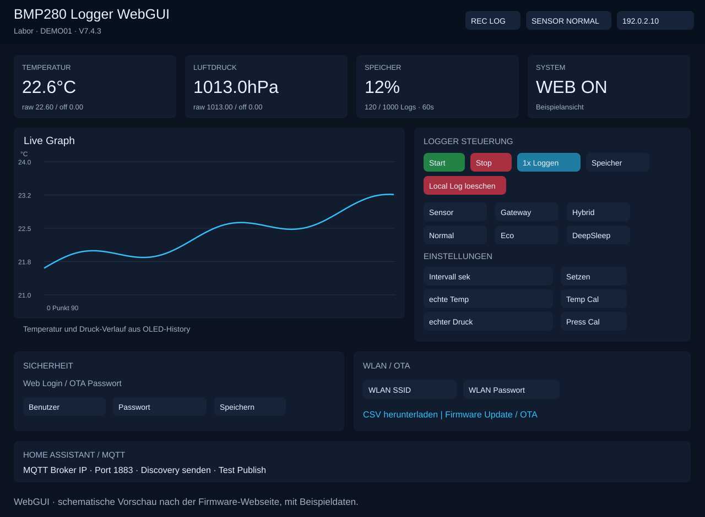
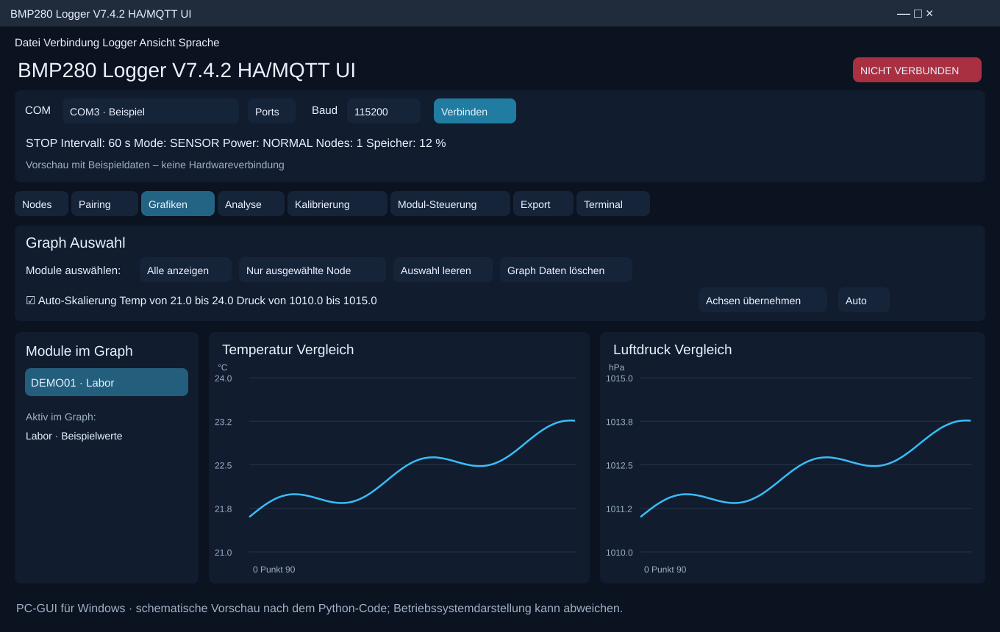

# Geräte-, Web- und PC-Ansichten

## Datenlogger im Gehäuse

## Displayseiten

Die Übersicht veranschaulicht drei vorhandene Displayseiten mit Beispielwerten.
Weitere Seiten der Firmware sind Temperatur, Verlauf, Aufzeichnung,
Verbindungen und Diagnose. Über CONTR wird das Menü geöffnet.

## WebGUI

Schematische Vorschau anhand der in Firmware V7.4.3 enthaltenen Weboberfläche.
Sie zeigt Messwerte, Speicherstatus, Logger-Steuerung, Kalibrierung, WLAN,
OTA und MQTT. Layoutdetails sind vereinfacht; die Werte sind Beispieldaten.

## PC-GUI für Windows

Schematische Vorschau anhand von `bmp280_logger_v74_gui.py` (GUI V7.4.2).
Dargestellt ist der Bereich **Grafiken** mit Modulauswahl und separaten
Temperatur-/Luftdruckdiagrammen. Die weiteren Register sind Nodes, Pairing,
Analyse, Kalibrierung, Modul-Steuerung, Export und Terminal.
Schriftarten, Fensterrahmen und Abstände können unter Windows abweichen.
Es handelt sich nicht um einen unter Windows aufgenommenen Screenshot.

[Installation und Bedienung](../README.md#pc-gui) · [Anschlussplan](HARDWARE.md)
