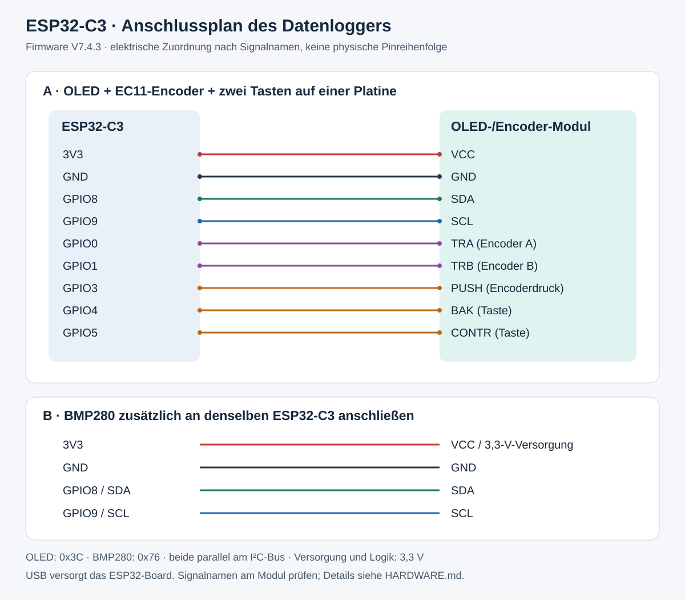

# Hardware und Anschlussplan

## Verwendetes Bedienmodul

Alex verwendet die kombinierte blaue OLED-/EC11-Encoder-Platine mit zwei
zusätzlichen Tasten (BAK und CONTR). Das Modul wurde vom Projektinhaber bestätigt.

OLED, Drehencoder und beide Tasten sitzen auf **derselben Platine**.
Die Firmware verwendet für das OLED den **SH1106-Treiber, 128 × 64 Pixel,
I²C-Adresse 0x3C**. Die Darstellung und Auflösung entsprechen der Firmware-Konfiguration.

## Anschlussplan

Der Plan zeigt elektrische Verbindungen nach **Signalnamen**, keine Ansicht der
Stiftleiste. Pinpositionen nicht aus der Zeichnung abzählen. Beschriftungen auf
der eigenen Platine verwenden. Die Zuordnung wurde mit den Pin-Definitionen,
`Wire.begin` und den `INPUT_PULLUP`-Einstellungen der Firmware V7.4.3 abgeglichen;
die verdeckte Verdrahtung im fertigen Gehäuse wurde nicht geprüft.

| ESP32-C3 | OLED-/Encoder-Modul | BMP280 |
|---|---|---|
| 3V3 | VCC, bei 3,3-V-Betrieb | 3,3-V-Versorgung des Breakouts |
| GND | GND | GND |
| GPIO8 | SDA | SDA |
| GPIO9 | SCL | SCL |
| GPIO0 | TRA / Encoder A | — |
| GPIO1 | TRB / Encoder B | — |
| GPIO3 | PUSH / Encoderdruck | — |
| GPIO4 | BAK | — |
| GPIO5 | CONTR | — |

Beide I²C-Geräte liegen parallel an GPIO8/GPIO9 und teilen Versorgung und Masse.
Die Adressen in der Firmware sind 0x3C (OLED) und 0x76 (BMP280).
Der BMP280 misst Temperatur und Luftdruck, keine Luftfeuchtigkeit.

## Aufbau und erste Prüfung

1. USB abziehen. GND und 3,3-V-Versorgung zu beiden Modulen verbinden.
2. SDA und SCL jeweils parallel zum OLED-Modul und BMP280 verdrahten.
3. Die fünf Encoder-/Tastensignale entsprechend der Tabelle anschließen.
   Die Firmware aktiviert interne Pull-ups; die Tasteneingänge werden nach GND
   betätigt.
4. Bei einem BMP280-Breakout mit herausgeführten CSB-/SDO-Pins dessen
   I²C-Konfiguration und Adressbrücken prüfen: Die Firmware erwartet 0x76.
   Eine andere Adresse muss am Modul oder im Sketch passend eingestellt werden.
5. Versorgung und Masse vor dem Einschalten auf Kurzschluss prüfen.
   Das ESP32-C3-Board über seinen USB-Anschluss versorgen. Die hier gezeigten
   Signale arbeiten mit 3,3-V-Pegeln.
6. Nach dem Start Anzeige, Messwerte, Drehrichtung, Encoderdruck und beide Tasten
   prüfen. Auf der Grafikseite schaltet Encoderdruck Temperatur/Druck um,
   BAK wechselt 1/6/12/24 Stunden und CONTR öffnet das Menü.

Das genaue BMP280-Breakout und dessen Brücken sind auf dem vorliegenden
Bedienmodulbild nicht sichtbar. Der Plan legt deshalb keine unbestätigte
physische Pinreihenfolge oder modulspezifische Lötbrücke fest.

## Gehäuse

[STL-Quelle, Dateiliste und Abmessungen](../README.md#gehäuse--3d-druck).

## Geräteansichten

Vorschauen mit Beispielwerten. [WebGUI und PC-GUI ansehen](ANSICHTEN.md).

## Einzelmodule und günstige Bezugsquellen

**Vom Projektinhaber am 15.09.2026 bestätigt:** Die verlinkten
ESP32-C3-SuperMini- und BMP280-Module entsprechen den verwendeten Modulen.
Der zuvor als „Nano“ bezeichnete Controller ist damit als **ESP32-C3 SuperMini**
zugeordnet. Die Bezugsquellen führen zu den bestätigten Modulbauformen.

### Verwendeter ESP32-C3 SuperMini

Bezugsquelle: [OTRONIC ESP32-C3 SuperMini](https://www.otronic.nl/de/esp32-c3-wi-fi-ble.html).
**4,99 €** Artikelpreis beim Abruf am 15.09.2026, zuzüglich Versand.
Laut Händler 4 MB Flash, ca. 22,52 × 18 mm.
Der Projektinhaber hat diese Bauform als sein verwendetes Modul bestätigt.
Vor einem Nachkauf GPIO-Verfügbarkeit, USB-Anschluss und Gehäusepassform prüfen.

### Verwendetes BMP280-Breakout

Bezugsquelle: [OTRONIC BMP280](https://www.otronic.nl/en/digital-barometer-pressure-sensor-module-bmp280.html).
**1,40 €** Artikelpreis beim Abruf am 15.09.2026, zuzüglich Versand.
Der Projektinhaber hat das verlinkte Breakout als sein verwendetes Modul
bestätigt; die frühere Farbbeschreibung „rot“ dient nicht mehr zur Abgrenzung.
Der Händler nennt 3,3-V-Versorgung, I²C/SPI und die Standardadresse 0x76.

Beide Artikel zusammen: **6,39 € vor Versand**. Versand nach Deutschland und
Endsumme im Warenkorb prüfen; der Händler berechnet Versand nach Größe/Gewicht
([Versandinformationen](https://www.otronic.nl/en/service/shipping-returns/)).
Die Angebote sind preiswerte gefundene Optionen, kein Nachweis des
marktweit günstigsten Gesamtpreises.

Die Farbe eines Breakouts allein legt Pinbelegung und Spannungsverträglichkeit
nicht fest. Für den vorhandenen Aufbau gilt weiterhin der dokumentierte
Anschlussplan nach Signalnamen.

