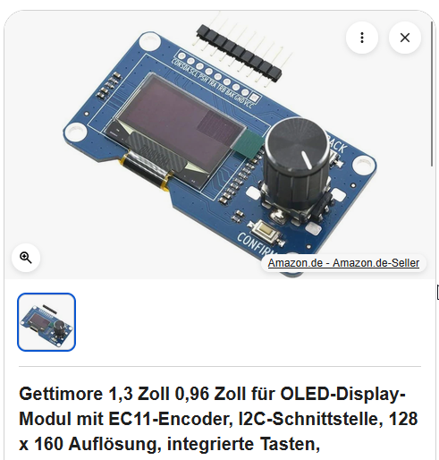
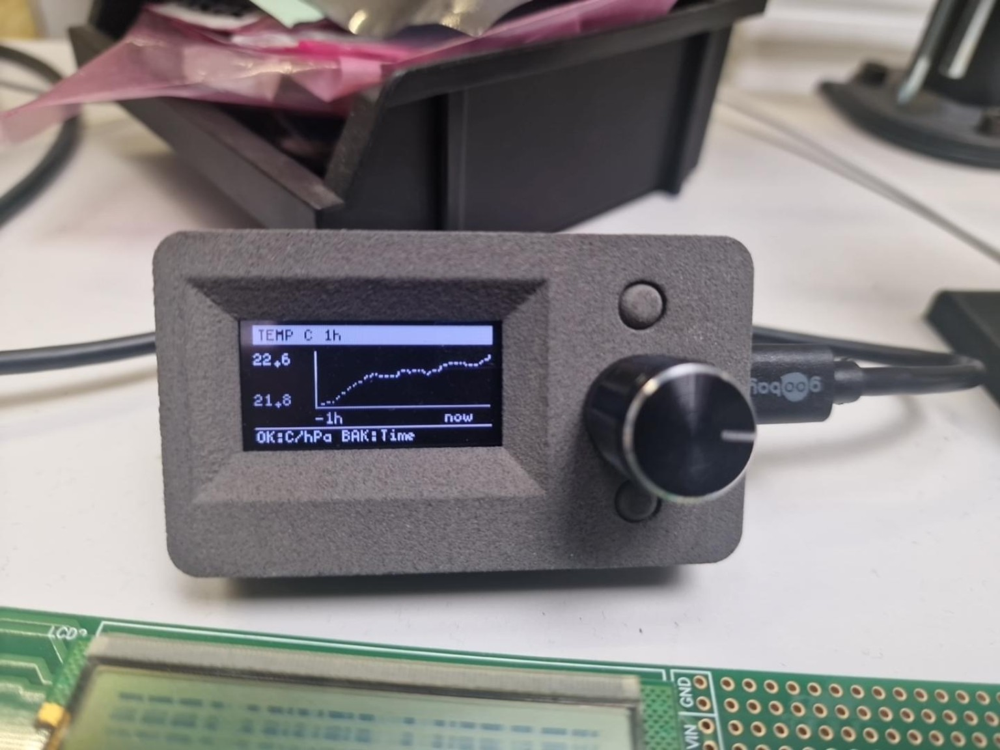

# Hardware und Anschlussplan

## Verwendetes Bedienmodul

Alex verwendet die kombinierte blaue OLED-/EC11-Encoder-Platine mit zwei
zusätzlichen Tasten (BAK und CONTR), die er als Produktbild bereitgestellt hat.
Im Screenshot wird sie als Gettimore OLED-Display-Modul mit EC11-Encoder angeboten.

OLED, Drehencoder und beide Tasten sitzen auf **derselben Platine**.
Die Firmware verwendet für das OLED den **SH1106-Treiber, 128 × 64 Pixel,
I²C-Adresse 0x3C**. Die Angebotsüberschrift nennt verschiedene Größen und
„128 × 160“; daraus lässt sich die tatsächlich gelieferte Displayvariante nicht
zuverlässig bestimmen. Maßgeblich für diese Dokumentation ist die verwendete
Firmware-Konfiguration. Eine Hersteller-Teilenummer ist noch nicht belegt.

## Anschlussplan

Der Plan zeigt elektrische Verbindungen nach **Signalnamen**, keine Ansicht der
Stiftleiste. Pinpositionen nicht aus der Zeichnung abzählen. Beschriftungen auf
der eigenen Platine verwenden. Die Zuordnung wurde mit den Pin-Definitionen,
`Wire.begin` und den `INPUT_PULLUP`-Einstellungen der Firmware V7.4.3 abgeglichen;
die verdeckte Verdrahtung im fertigen Gehäuse wurde nicht geprüft.

| ESP32-C3 | OLED-/Encoder-Modul | BMP280 |
|---|---|---|
| 3V3 | VCC, bei 3,3-V-Betrieb | 3,3-V-Versorgung des Breakouts |
| GND | GND | GND |
| GPIO8 | SDA | SDA |
| GPIO9 | SCL | SCL |
| GPIO0 | TRA / Encoder A | — |
| GPIO1 | TRB / Encoder B | — |
| GPIO3 | PUSH / Encoderdruck | — |
| GPIO4 | BAK | — |
| GPIO5 | CONTR | — |

Beide I²C-Geräte liegen parallel an GPIO8/GPIO9 und teilen Versorgung und Masse.
Die Adressen in der Firmware sind 0x3C (OLED) und 0x76 (BMP280).
Der BMP280 misst Temperatur und Luftdruck, keine Luftfeuchtigkeit.

## Aufbau und erste Prüfung

1. USB abziehen. GND und 3,3-V-Versorgung zu beiden Modulen verbinden.
2. SDA und SCL jeweils parallel zum OLED-Modul und BMP280 verdrahten.
3. Die fünf Encoder-/Tastensignale entsprechend der Tabelle anschließen.
   Die Firmware aktiviert interne Pull-ups; die Tasteneingänge werden nach GND
   betätigt.
4. Bei einem BMP280-Breakout mit herausgeführten CSB-/SDO-Pins dessen
   I²C-Konfiguration und Adressbrücken prüfen: Die Firmware erwartet 0x76.
   Eine andere Adresse muss am Modul oder im Sketch passend eingestellt werden.
5. Versorgung und Masse vor dem Einschalten auf Kurzschluss prüfen.
   Das ESP32-C3-Board über seinen USB-Anschluss versorgen. Die hier gezeigten
   Signale arbeiten mit 3,3-V-Pegeln.
6. Nach dem Start Anzeige, Messwerte, Drehrichtung, Encoderdruck und beide Tasten
   prüfen. Auf der Grafikseite schaltet Encoderdruck Temperatur/Druck um,
   BAK wechselt 1/6/12/24 Stunden und CONTR öffnet das Menü.

Das genaue BMP280-Breakout und dessen Brücken sind auf dem vorliegenden
Bedienmodulbild nicht sichtbar. Der Plan legt deshalb keine unbestätigte
physische Pinreihenfolge oder modulspezifische Lötbrücke fest.

## Gehäuse

[STL-Quelle, Dateiliste und Abmessungen](../README.md#gehäuse--3d-druck).

## Fotos des fertigen Geräts

*KI-retuschierte Produktansicht; für unveränderte Details siehe Originalfoto.*

Das Originalfoto zeigt den realen Aufbau des Projektinhabers mit laufender
Temperaturkurve. Es belegt keinen vollständigen Firmware- oder Langzeittest.
Separate Originalfotos des ESP32-C3 und BMP280 stehen noch aus.
