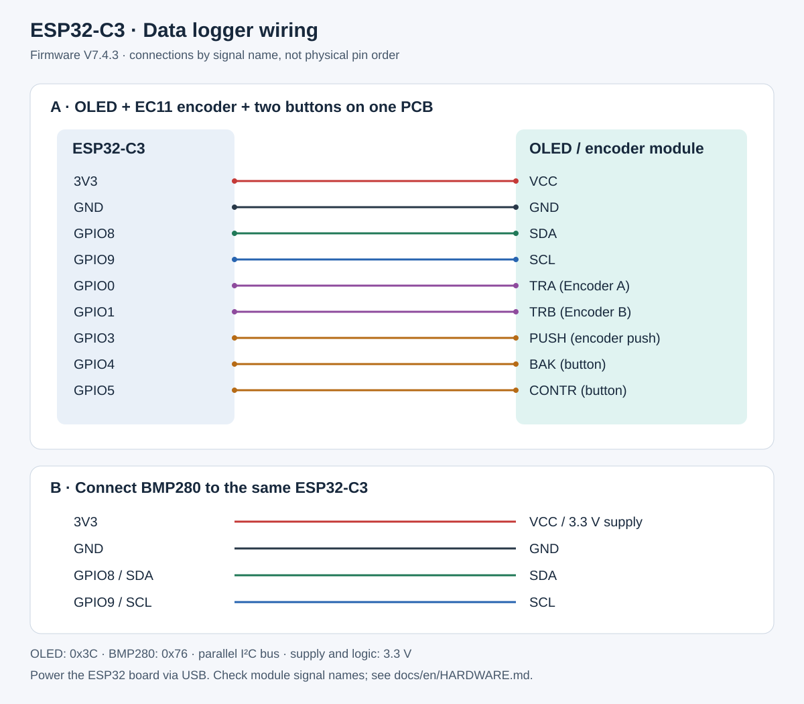

# Hardware and wiring

[🇩🇪 Deutsch](../HARDWARE.md) | **🇬🇧 English**

## Control module used

Alex uses the confirmed blue OLED/EC11 encoder PCB with two additional buttons, BAK and CONTR.
**OLED, encoder and both buttons share one PCB.**
Firmware configuration: **SH1106, 128 × 64 pixels, I²C 0x3C**.

## Wiring diagram

The diagram maps **signal names**, not physical header positions. Use the labels on your board rather than counting pins from the illustration.
Connections were checked against V7.4.3 pin definitions, `Wire.begin` and `INPUT_PULLUP` settings; hidden wiring inside the assembled enclosure was not inspected.

| ESP32-C3 | OLED/encoder module | BMP280 |
|---|---|---|
| 3V3 | VCC for 3.3 V operation | Breakout 3.3 V supply |
| GND | GND | GND |
| GPIO8 | SDA | SDA |
| GPIO9 | SCL | SCL |
| GPIO0 | TRA / encoder A | — |
| GPIO1 | TRB / encoder B | — |
| GPIO3 | PUSH / encoder push | — |
| GPIO4 | BAK | — |
| GPIO5 | CONTR | — |

Both I²C devices connect in parallel to GPIO8/GPIO9 and share supply and ground.
Firmware addresses: OLED 0x3C, BMP280 0x76.
BMP280 measures temperature and atmospheric pressure, not humidity.

## Assembly and initial checks

1. Disconnect USB. Connect ground and the 3.3 V supply to both modules.
2. Connect SDA and SCL in parallel to the OLED module and BMP280.
3. Connect the five encoder/button signals as shown. Firmware enables internal pull-ups; button inputs are pulled to ground when pressed.
4. On BMP280 breakouts exposing CSB/SDO, check I²C configuration and address jumpers. Firmware expects 0x76. A different address requires a matching board or sketch setting.
5. Check supply and ground for a short circuit before powering up. Power the ESP32-C3 board through USB. These signals use 3.3 V logic.
6. Check display, readings, rotation direction, encoder push and both buttons. On the graph page, encoder push switches temperature/pressure, BAK selects 1/6/12/24 hours and CONTR opens the menu.

Actual solder-bridge settings have not been inspected. The diagram therefore does not specify an unverified physical pin order or board-specific solder bridge.

## Enclosure

[STL source, file list and dimensions](../../README.en.md#enclosure--3d-printing).

## Device views

Previews with example values. [WebGUI and desktop GUI](ANSICHTEN.md).

## Modules and purchasing sources

**Confirmed by the project owner on September 15, 2026:** the linked ESP32-C3 SuperMini and BMP280 modules match the modules used. The controller previously called “Nano” is identified as **ESP32-C3 SuperMini**.

### ESP32-C3 SuperMini

Source: [OTRONIC ESP32-C3 SuperMini](https://www.otronic.nl/de/esp32-c3-wi-fi-ble.html).
Item price observed on September 15, 2026: **€4.99**, plus shipping.
The seller specifies 4 MB flash and approximately 22.52 × 18 mm.
The owner confirmed this board type. Before purchasing a replacement, check GPIO availability, USB connector and enclosure fit.

### BMP280 breakout

Source: [OTRONIC BMP280](https://www.otronic.nl/en/digital-barometer-pressure-sensor-module-bmp280.html).
Item price observed on September 15, 2026: **€1.40**, plus shipping.
The owner confirmed the linked breakout; the earlier description “red” is no longer used to distinguish it.
The seller specifies 3.3 V supply, I²C/SPI and default address 0x76.

Combined item price: **€6.39 before shipping**. Check delivery to Germany and the final cart total; shipping depends on size/weight ([shipping information](https://www.otronic.nl/en/service/shipping-returns/)).
These are inexpensive options found, not a verified market-wide lowest total.

PCB colour alone does not establish pinout or voltage tolerance.
Use the documented signal-name wiring diagram for this build.
